<p align="center">
  
</p>

<h1 align="center">Menu Forge</h1>

<p align="center"><strong>Français</strong> · <a href="README.en.md">English</a></p>

<p align="center">
  <strong>Dessinez des inventaires Minecraft custom au pixel près, ouvrez-les en jeu sans calculer un seul décalage.</strong><br>
  Un studio local (appli de bureau ou navigateur) et une lib Paper, reliés par un format JSON ouvert.
</p>

<p align="center">
  <a href="https://pedrokarim.github.io/menu-forge/">Site du projet</a> ·
  <a href="docs/rendering.md">Modèle de rendu</a> ·
  <a href="docs/format.md">Format</a> ·
  <a href="docs/roadmap.md">Feuille de route</a>
</p>


> **État : jeune projet, en développement actif.** Le modèle de rendu est validé
> en jeu (Paper 1.20.6), le studio et la lib fonctionnent de bout en bout, mais
> il n’y a pas encore de version publiée : on construit depuis les sources.

Menu Forge est né pour **Enderium**, un serveur Minecraft : son plugin
(`enderium-core`) est le premier consommateur de la lib, branchée sur ses
actions, ses conditions et son pipeline de resource pack par un adaptateur.
La lib, elle, ne dépend d’aucun type d’Enderium et sert n’importe quel serveur
Paper.
Son écran `/profile` est le premier vrai menu recréé dans le studio, avec des
textures générées : le serveur de test d’Enderium le charge, en attendant sa
validation en jeu avec un client.

## Pourquoi

Les menus « modernes » des serveurs Minecraft (onglets, modales, boutons
colorés, barres de progression…) ne sont pas des mods. Ce sont des **coffres
vanilla** dont le cadre est masqué et dont le **titre** contient des images,
dessinées par une police custom du resource pack. Le résultat est superbe, mais
le fabriquer à la main est pénible : chaque couche est un glyphe, chaque glyphe
a son `ascent` et son avance, et un pixel de travers décale tout ce qui suit.

Menu Forge automatise toute la chaîne :

1. **Studio** (`studio/`) : on dessine le menu sur une toile calée sur la grille
   des slots, à partir de gabarits ou du générateur d’interfaces ; on place
   les couches, les textes dynamiques, les zones cliquables et leurs actions.
2. **Format** (`docs/format.md`) : le studio exporte un fichier `*.menu.json` et
   ses PNG, lisibles et versionnables.
3. **Lib** (`lib/`) : côté serveur Paper, elle lit ces fichiers, génère les
   polices du resource pack et ouvre les menus (titre composé selon l’état,
   slots, actions, pagination).

## Fonctionnalités

**Studio**

- Toile au pixel près, fond « cases seules » ou coffre vanilla, zoom et
  aimantation sur la grille des slots.
- Couches **générées** (panneau biseauté, bouton, cellule, voile, aplat) ou
  importées en PNG, déplaçables à la souris et au clavier, réordonnables,
  rognables (sprites d’atlas).
- Textes dynamiques avec variables (`{viewer.name}`, `{page.number}`…) et
  alignement à gauche, au centre ou à droite, mesurés avec les avances du jeu.
- **Police pixel de Menu Forge**, dessinée pour le projet : sans pack vanilla
  branché, les textes s’affichent avec les mêmes avances qu’en jeu (le pack
  vanilla reste nécessaire pour exporter un asset avec la police du jeu).
- Zones de slots dessinées sur la grille : bouton, liste paginée, dépôt,
  décoration ; actions au clic (ouvrir, retour, état, page, son, commande,
  action custom).
- Variables d’état, conditions d’affichage et d’activation, aperçu de chaque
  état.
- **Titre composé en direct**, jeton par jeton, avec le même algorithme que la
  lib : ce que vous voyez est ce que le joueur verra.
- Gabarits (coffre classique, modale, liste paginée, barre d’onglets) et
  héritage (`extends`).
- **Générateur d’interfaces** : boutique, grille, modale de confirmation,
  liste paginée ou barre d’onglets, complète en quelques champs (lignes,
  boutons, disposition, accent), dans trois familles de styles – Deepslate
  (biseauté), mc-rs (sombre, arrondi) et « sombre à accent » (plat) – avec un
  aperçu en direct où onglets et pages se cliquent ; le menu créé se retouche
  ensuite comme un autre.
- **Mode libre** : un éditeur d’assets (encarts, bulles de touche, badges…)
  exportés en PNG et en glyphe, prêts à glisser dans un texte.
- **Éditeur de pixels** (mode « Pixels ») : crayon, gomme, pot de peinture,
  pipette, ligne, rectangle, ellipse, sélection rectangulaire, lasso, baguette
  magique, palette et couleurs du document, calques (opacité, fusion),
  symétrie, zoom de ×1 à ×64 ; le PNG exporté sert tel quel dans les menus et
  les assets.
- **Gestes d’édition** : sélection multiple (Maj ou Ctrl + clic, rectangle,
  `Ctrl+A`), copier / couper / coller par le presse-papiers du système,
  aligner et répartir, groupes (assets), verrouiller et masquer, renommer,
  dupliquer ou mettre à la corbeille un document, glisser-déposer d’un PNG
  depuis l’explorateur.
- **Éditer sans JSON** : éditeurs visuels des actions au clic (réordonnables),
  des conditions (arbre « toutes », « au moins une », « pas »), des variables
  d’état et des items (MiniMessage avec aperçu).
- **Mode « Essayer »** (`E`) : un clic sur un slot exécute ses actions comme en
  jeu (état, pages, `open` et `back`, fermeture) ; commandes et sons sont
  écrits au journal, le document n’est jamais modifié.
- **Composants** réutilisables (`component`, `includes`) : une pagination ou
  un bouton retour dessinés une fois, posés dans plusieurs menus, décalés ou
  préfixés ; créés depuis une sélection, détachables.
- **Export** : « Exporter vers le plugin » (`Ctrl+E`, menus résolus et
  textures dans le dossier réglé) et « Pack ZIP » de test (`Ctrl+Maj+E`,
  polices, textures, `pack.mcmeta`) ; polices identiques, octet pour octet,
  à celles de la lib.
- **Schémas JSON** des menus et des assets
  ([`docs/menu.schema.json`](docs/menu.schema.json),
  [`docs/asset.schema.json`](docs/asset.schema.json)) pour valider un fichier
  écrit à la main ou généré.
- **Génération par IA** (facultative) : une texture ou une interface décrite
  en quelques mots, avec onze fournisseurs, en ligne (OpenAI, Google Gemini,
  Anthropic, Mistral, Stability AI, fal, Replicate), sur ce poste (ComfyUI,
  Automatic1111, Ollama) ou en ligne de commande (Codex CLI). Aucun n’est
  contacté tant qu’il n’est pas activé dans les Paramètres ; les clés d’API
  vont dans le trousseau du système, jamais dans les réglages ; les services
  en ligne facturent chaque génération. Le résultat est contraint : texture
  ramenée sur la grille des pixels et une palette imposée, menu validé par le
  schéma et les règles de la lib, erreurs renvoyées au modèle (5 essais au
  plus), puis ouvert dans l’éditeur pour relecture. Vérifié avec des
  fournisseurs simulés, pas encore avec de vraies clés : voir
  [`docs/ai.md`](docs/ai.md).
- Bibliothèques de packs branchées en local (lecture seule, jamais publiées),
  annuler / rétablir, raccourcis clavier partout, aide-mémoire `?`.
- Style « Deepslate » : ardoise, biseaux de 2 px, or pour la sélection,
  infobulles violettes façon objet du jeu.

**Lib Java** (`lib/`)

- `menu-forge-core` (Java 17, Gson seulement) : parseur avec le chemin de la
  clé fautive, gabarits, conditions, mesure des PNG, composition du titre,
  génération du pack (une police par menu).
- `menu-forge-paper` : plugin Paper autonome **MenuForge**, avec une API et des
  points d’extension (`ListProvider`, `FlagProvider`, `PlaceholderResolver`,
  `ItemFactory`, `CustomActionHandler`), une session par joueur avec pile pour
  `back`, et les commandes `/menuforge open`, `reload`, `calibrate`.
- Espaces de travail supplémentaires (`addWorkspace`) : un plugin embarque ses
  propres menus. C’est ainsi que l’**adaptateur d’Enderium** (dans
  enderium-core) fournit les siens, branche les actions `custom` sur ses
  ClickActions et les drapeaux sur ses conditions, et fusionne les polices
  générées dans son pack.
- Testée : 46 tests du noyau, dont les cas de parité partagés avec le studio,
  et 28 tests du plugin sur un serveur simulé (MockBukkit).

## Captures

| | |
|---|---|
| 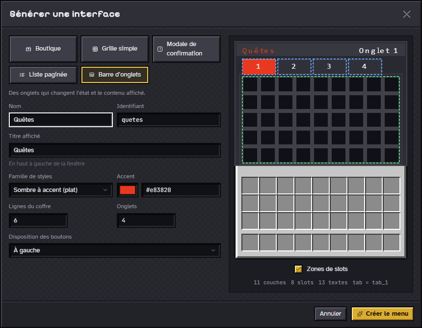 | 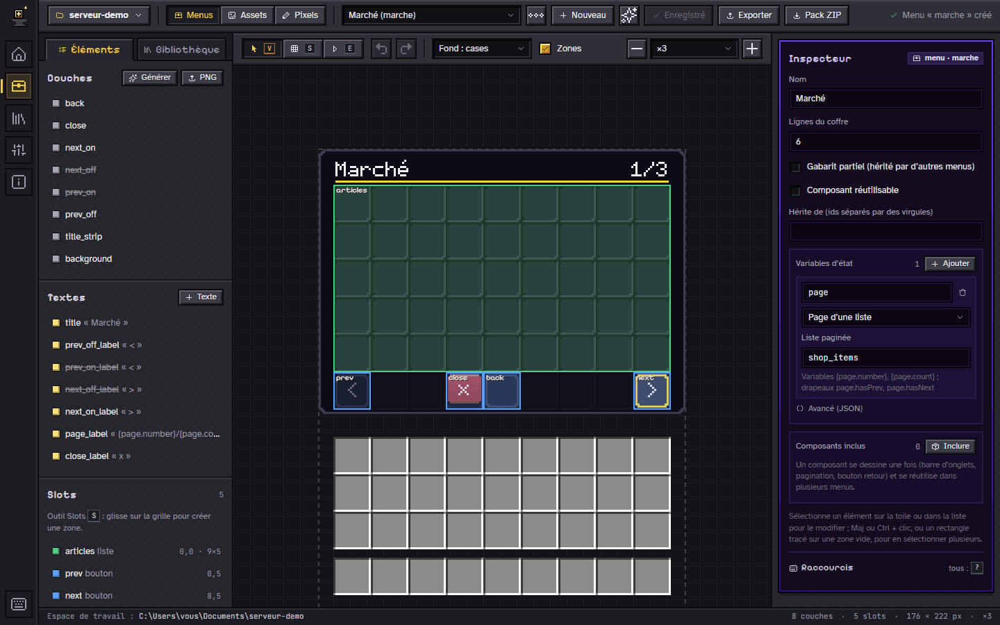 |
| **Générateur d’interfaces** : cinq types, trois familles de styles, aperçu cliquable. | **Menu généré** : couches, textes et slots ordinaires, à retoucher. |
| 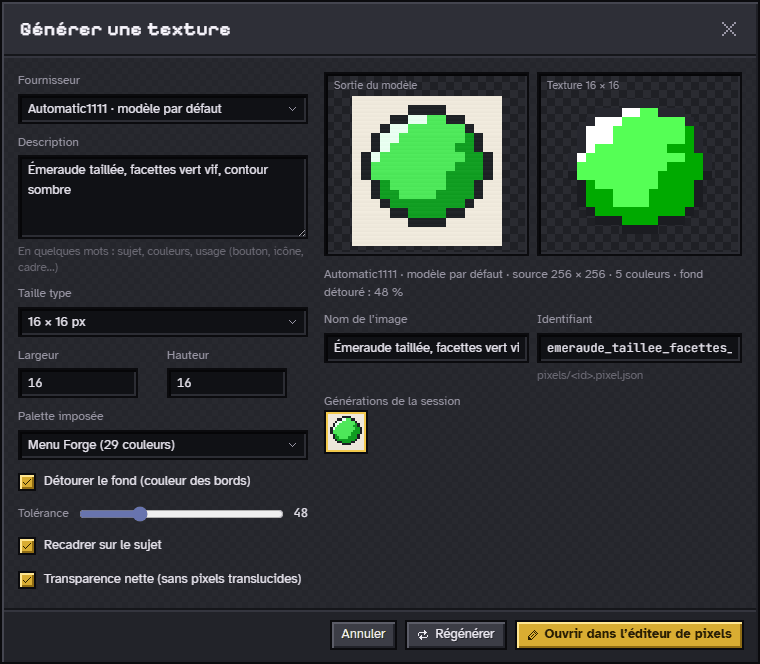 | 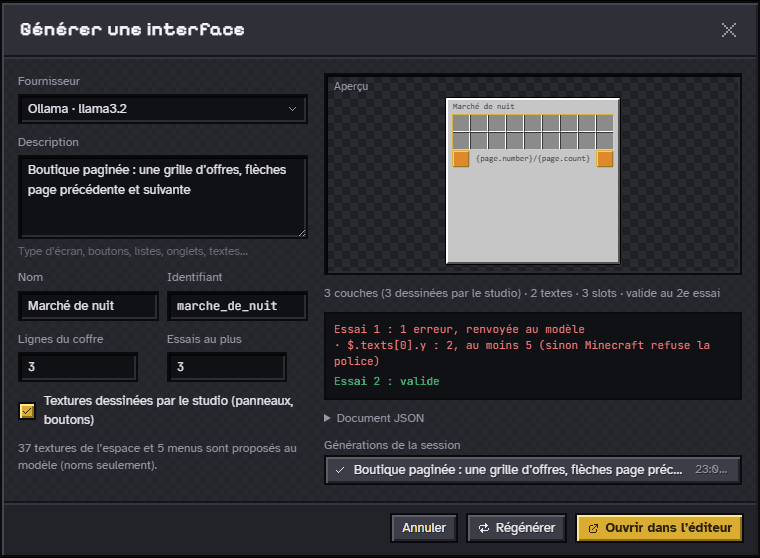 |
| **Texture par IA** : grille de pixels, palette imposée, fond détouré. | **Interface par IA** : validée par le schéma, erreurs renvoyées au modèle. |
| 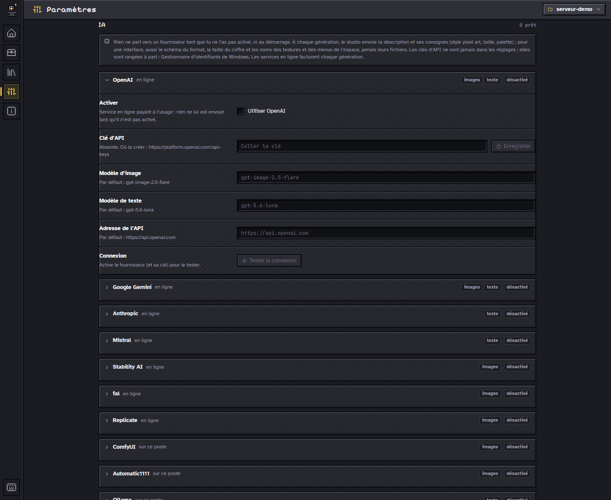 | 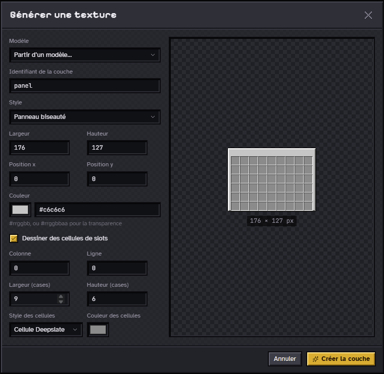 |
| **IA, Paramètres** : rien ne part sans activation, clés dans le trousseau. | **Textures générées** : panneaux, boutons, cellules, sans rien dessiner. |
|  |  |
| **Éditeur de pixels** : calques, symétrie, palette, zoom jusqu’à ×64. | **Essayer** : les actions s’exécutent comme en jeu, le journal les suit. |
| 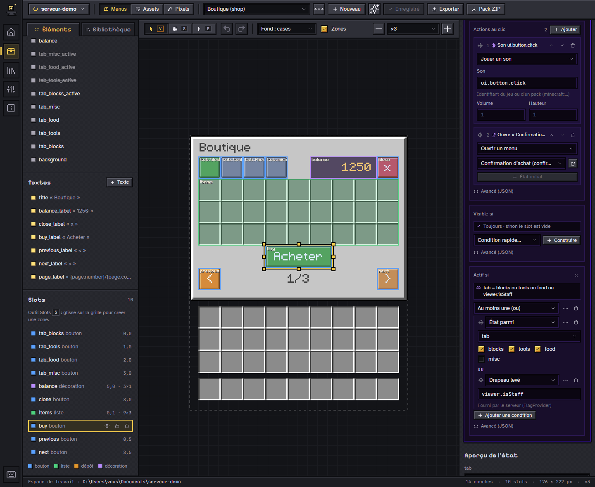 | 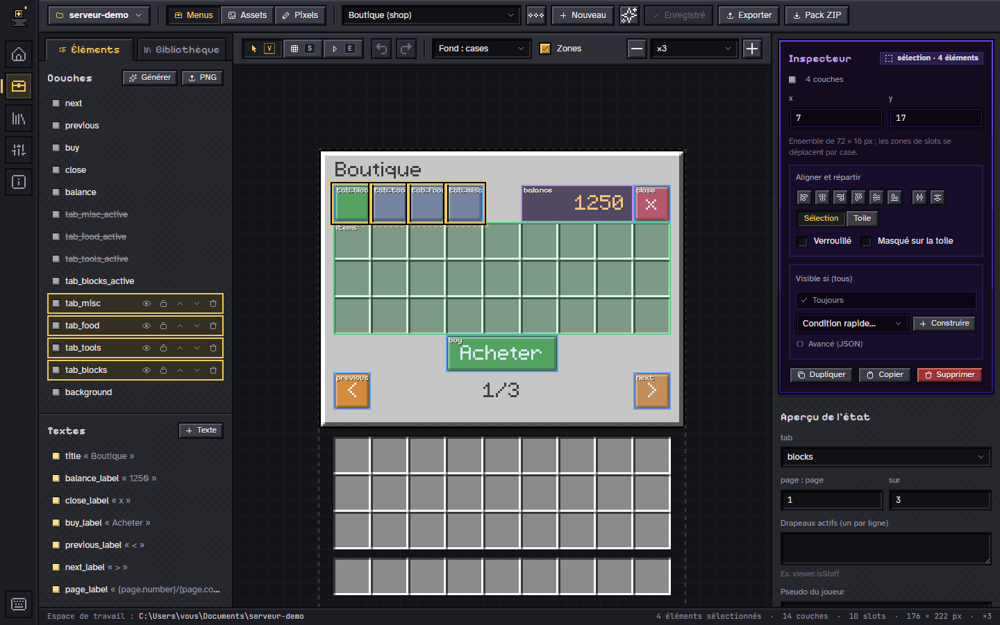 |
| **Sans JSON** : actions au clic et conditions en arbre, dans l’inspecteur. | **Gestes d’édition** : sélection multiple, aligner et répartir. |
| 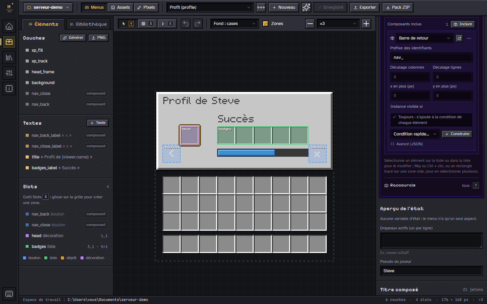 | 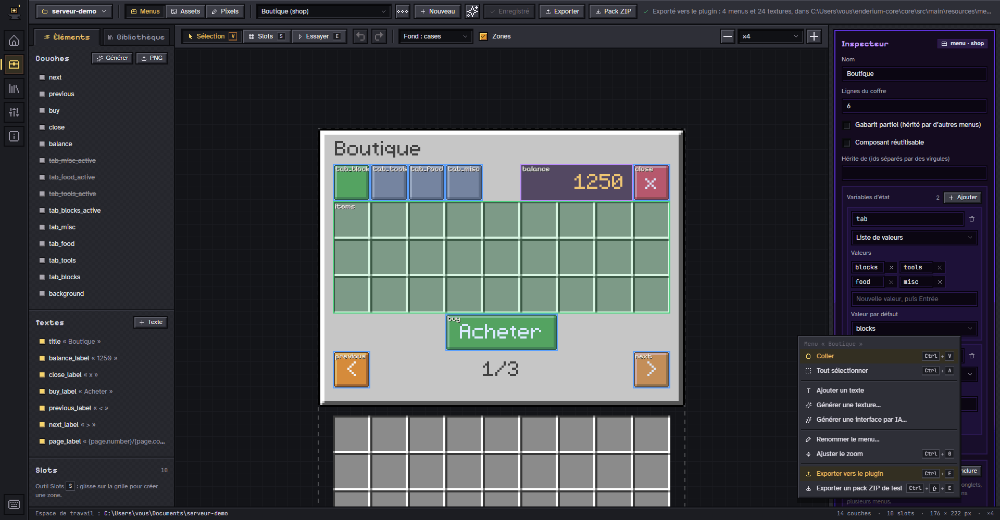 |
| **Composants** : dessinés une fois, inclus dans plusieurs menus. | **Export** : vers le plugin (`Ctrl+E`) ou en pack ZIP de test. |
| 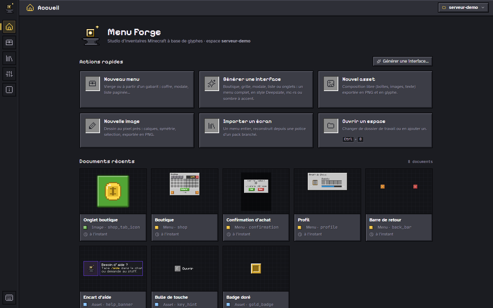 | 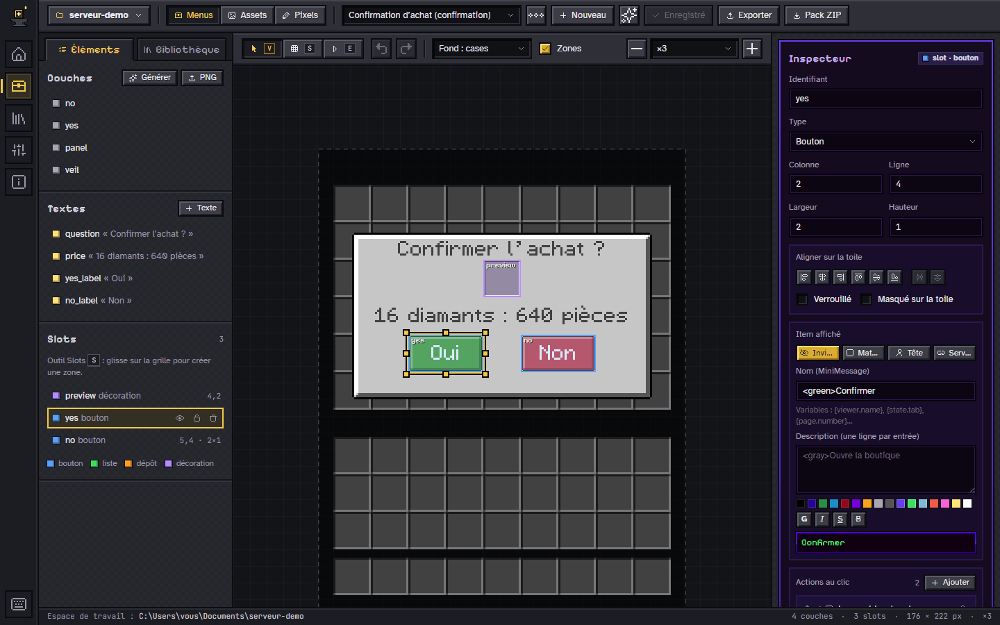 |
| **Accueil** : actions rapides, documents récents avec vignettes. | **Modales** : voile, panneau centré, boutons câblés sur des actions. |
| 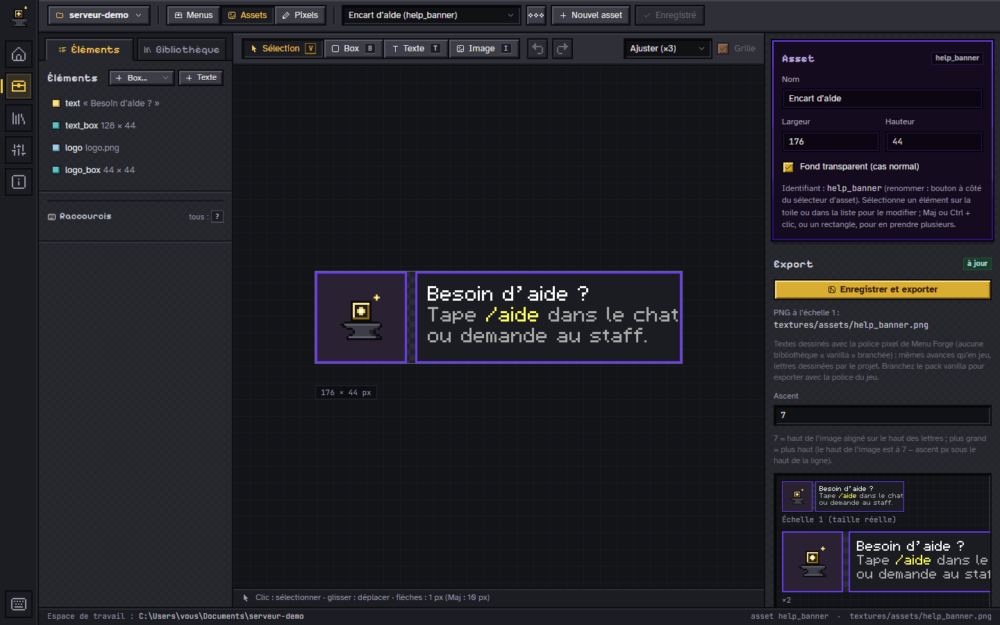 | 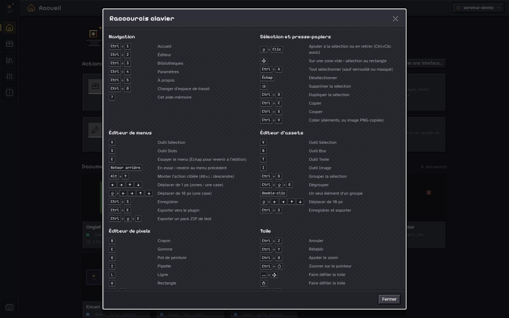 |
| **Mode libre** : composer un asset et l’exporter en glyphe. | **Raccourcis** : tout se fait aussi au clavier. |

Toutes les captures sont produites par un script, sur un espace de
démonstration fait **uniquement** de textures générées ou dessinées par le studio : voir
[`site/README.md`](site/README.md).
Les captures de la génération par IA passent par des fournisseurs simulés sur
le poste : aucun service n’est appelé, aucune clé n’est utilisée.

## Comment ça marche


Un menu de Menu Forge est un coffre `generic_9xN` ordinaire. Deux astuces de
resource pack font le reste :

1. la texture du coffre est remplacée par une image « cases seules » : le cadre
   disparaît, les cellules des slots restent ;
2. tout le visuel est écrit dans le **titre** du coffre, avec une police dont
   chaque caractère est une image (provider `bitmap`).

Pour chaque couche visible, la lib écrit un **espace négatif ou positif** qui
amène le curseur à la bonne abscisse, puis le **glyphe** de la couche, dont
l’`ascent` fixe la hauteur (`ascent = 13 − y`). Le piège : Minecraft fait
avancer le curseur de la dernière colonne opaque de l’image + 2, pas de sa
largeur. Menu Forge recadre chaque couche et **mesure son avance sur les
pixels**, dans le studio comme dans la lib.

Les slots restent de vrais slots : un bouton, c’est une image dans le titre
plus un slot (souvent avec un item invisible) posé au même endroit. Le titre
est dessiné sous les items, donc une couche peut peindre le fond d’un bouton
sans masquer son icône.

Tous les détails, mesurés et validés en jeu : [`docs/rendering.md`](docs/rendering.md).

## Installation

Prérequis : **Node 24**, **Rust stable** (1.95 ou plus), et sous Windows
**WebView2** (présent sur Windows 11). Pour la lib : **JDK 21**.

```sh
git clone https://github.com/pedrokarim/menu-forge.git
cd menu-forge/studio
npm install
```

### Le studio en appli de bureau (Tauri)

```sh
npm run tauri:dev     # fenêtre de développement
npm run tauri:build   # installateur Windows (NSIS)
```

L’installateur est écrit dans
`studio/src-tauri/target/release/bundle/nsis/`. Au premier lancement, le studio
propose un espace de travail (`Documents/menu-forge`, créé s’il manque).

### Le studio dans le navigateur

```sh
npm run dev
```

Lance le backend Rust (`studio-api`, sur `127.0.0.1:5174`) et Vite sur
<http://localhost:5173>. Le serveur n’écoute qu’en local et refuse toute
requête d’une autre origine. Options, réglages et API : [`studio/README.md`](studio/README.md).

### La lib Paper (plugin MenuForge)

```sh
cd lib
./gradlew build
```

Le plugin vise **Paper 1.20.6 et plus** (Java 21, `api-version` 1.20). Sur
1.21.4 et plus, il sait aussi donner un modèle d’item (`item_model`) aux
boutons invisibles ; avant, il utilise `CustomModelData`.

1. Déposer `menu-forge-paper/build/libs/MenuForge-<version>.jar` dans
   `plugins/`.
2. Copier les menus exportés par le studio dans
   `plugins/MenuForge/workspace/menus/` et leurs images dans
   `plugins/MenuForge/workspace/textures/`.
3. Au démarrage (et à chaque `/menuforge reload`), le plugin génère le pack de
   polices dans `plugins/MenuForge/pack/` : **intégrez-le au resource pack de
   votre serveur**.

Le visuel « cases seules » du coffre n’est pas fourni : c’est au pack du
serveur de le porter. API, points d’extension et configuration :
[`lib/README.md`](lib/README.md).

### Du studio au serveur

Dans l’éditeur de menus, **Exporter** (`Ctrl+E`) enregistre le menu ouvert,
puis écrit tous les menus de l’espace, gabarits appliqués, et les PNG qu’ils
utilisent dans `<dossier réglé>/menuforge/` (`menus/`, `textures/`), avec un
manifeste : un export suivant ne retire que ce que le précédent avait écrit.
Le dossier se règle dans **Paramètres › Export vers le plugin**. Pour le
plugin MenuForge autonome, copiez `menus/` et `textures/` dans
`plugins/MenuForge/workspace/` ; un plugin qui embarque ses menus les déclare
avec `addWorkspace`, comme Enderium.

**Pack ZIP** (`Ctrl+Maj+E`) écrit `exports/<namespace>-pack.zip` dans
l’espace de travail : polices et textures générées avec le même algorithme
que la lib (parité vérifiée octet pour octet par une fixture partagée) et
`pack.mcmeta`, à essayer sans serveur.

## Structure du dépôt

| Dossier | Rôle |
|---|---|
| [`docs/`](docs/) | Spécification des formats et schémas JSON, modèle de rendu, écrans, feuille de route (source de vérité) |
| [`studio/`](studio/) | Studio : interface Vite + React + TypeScript (`src/`), backend Rust (`backend/`), coquille Tauri 2 (`src-tauri/`) |
| [`lib/`](lib/) | Lib Java : noyau autonome `menu-forge-core` et plugin `menu-forge-paper` |
| [`templates/`](templates/) | Gabarits fournis (coffre, modale, onglets, liste paginée) |
| [`examples/`](examples/) | Espace de travail d’exemple du mode navigateur (contenu non versionné) |
| [`site/`](site/) | Site du projet (GitHub Pages) et script des captures |

## Documentation

- [`docs/rendering.md`](docs/rendering.md) : comment une couche devient un glyphe,
  coordonnées, `ascent`, avance, pièges connus.
- [`docs/format.md`](docs/format.md) : le format `*.menu.json` (couches, textes,
  slots, état, conditions, actions, gabarits).
- [`docs/assets.md`](docs/assets.md) : le format `*.asset.json` du mode libre.
- [`docs/pixels.md`](docs/pixels.md) : le format `*.pixel.json` de l’éditeur de
  pixels, ses outils et ses raccourcis.
- [`docs/ai.md`](docs/ai.md) : la génération par IA (fournisseurs, clés, ce
  qui est envoyé, coûts, contraintes, limites).
- [`docs/menu.schema.json`](docs/menu.schema.json) et
  [`docs/asset.schema.json`](docs/asset.schema.json) : les schémas JSON des
  deux formats.
- [`docs/screens.md`](docs/screens.md) : les écrans de l’application.
- [`docs/discord.md`](docs/discord.md) : la Rich Presence Discord (facultative).
- [`studio/README.md`](studio/README.md) : lancer, construire, API locale.
- [`lib/README.md`](lib/README.md) : la lib, le plugin et ses points d’extension.

## Feuille de route

Détail vivant dans [`docs/roadmap.md`](docs/roadmap.md).
Arrivés récemment : le générateur d’interfaces et ses trois familles de
styles, la génération par IA multi-fournisseurs et la police pixel de Menu
Forge ; avant eux : l’éditeur de pixels, les gestes d’édition, les éditeurs
visuels et le mode « Essayer », les composants, l’export vers le plugin et le
pack ZIP, les schémas JSON. Prochaines étapes :

- valider en jeu, avec un client, l’écran `/profile` d’Enderium, puis migrer
  ses autres écrans (succès, royaumes, maisons) ;
- studio : repères posés à la main, restaurer un document depuis la corbeille ;
- composants : surcharger un seul champ d’un élément d’instance ; aperçu des
  slots « liste » en mode « Essayer » ;
- éditeur de pixels : animations et planches de sprites, palettes
  enregistrées, dégradés ;
- IA : essayer chaque fournisseur avec une vraie clé (identifiants des modèles
  par défaut, transparence réelle des images, refus de contenu, délais) ;
- décider du sort de la texture globale du coffre (`generic_54.png`).

## Contribuer

Les contributions sont bienvenues : ouvrez d’abord une issue pour discuter d’un
changement important. Quelques règles du dépôt (détail dans
[`AGENTS.md`](AGENTS.md)) :

- **identifiants en anglais**, sans exception (variables, fonctions, types,
  fichiers, clés JSON du format) ; commentaires, textes d’interface, docs et
  messages de commit **en français** ;
- typographie française dans la prose : tiret demi-cadratin (–) pour une
  incise, guillemets « … », espaces insécables avant `: ; ! ?` ;
- **aucun asset tiers** dans le dépôt : les gabarits et textures fournis sont
  générés ou dessinés par le projet ;
- avant une pull request : `npm run build` et `npm run lint` dans `studio/`,
  `cargo test` dans `studio/backend/`, `./gradlew build` dans `lib/`.

## Licence

Menu Forge est distribué sous licence **MIT**, © 2026 Karim (pedrokarim) : voir [`LICENSE`](LICENSE).
Les composants tiers gardent leur propre licence (ci-dessous).

## Crédits

| Composant | Usage | Licence |
|---|---|---|
| [Pixelarticons](https://github.com/halfmage/pixelarticons) | Icônes | MIT |
| [Pixelify Sans](https://github.com/eifetx/Pixelify-Sans) | Titres | SIL Open Font License 1.1 |
| [Atkinson Hyperlegible](https://www.brailleinstitute.org/freefont/) | Texte | SIL Open Font License 1.1 |
| [JetBrains Mono](https://github.com/JetBrains/JetBrainsMono) | Code et chemins | SIL Open Font License 1.1 |
| [React](https://react.dev/) | Interface | MIT |
| [Tauri](https://tauri.app/) | Application de bureau | MIT ou Apache 2.0 |
| [Gson](https://github.com/google/gson) | Lecture du format (lib) | Apache 2.0 |

Le studio embarque les polices des paquets `@fontsource` (et Pixelify Sans
dans `studio/public/fonts/` pour l’écran de démarrage) ; le site les
auto-héberge dans `site/assets/fonts/`, chacune avec sa licence.

## Mentions

Menu Forge n’est ni affilié à Mojang ni approuvé par Mojang ; Minecraft est une
marque de Mojang AB. Le dépôt ne contient aucun asset de Minecraft : la police
du jeu et les packs tiers ne sont lus que depuis le poste de l’utilisateur, et
restent la propriété de leurs auteurs.
