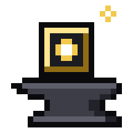
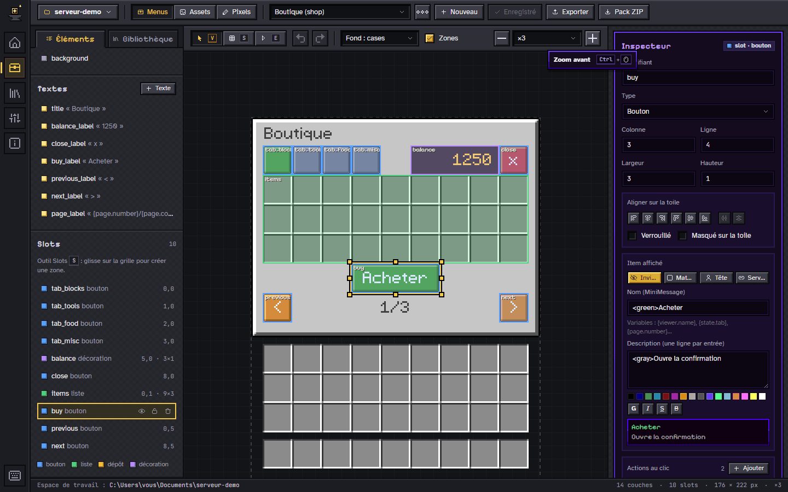
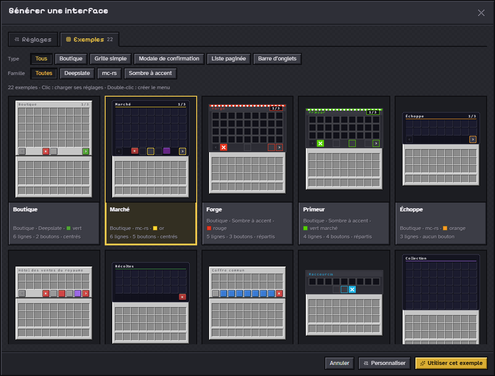
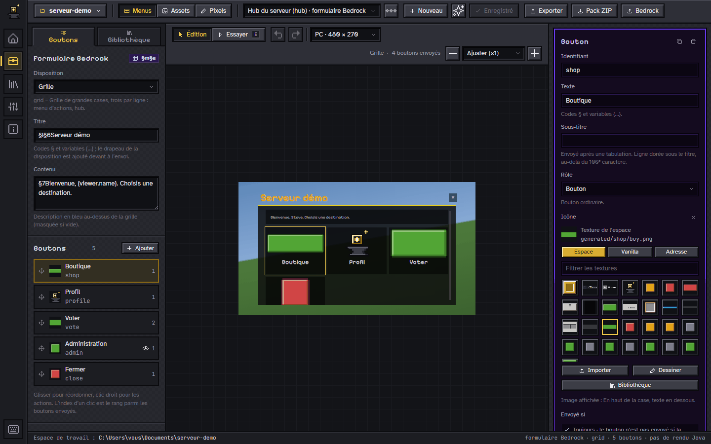
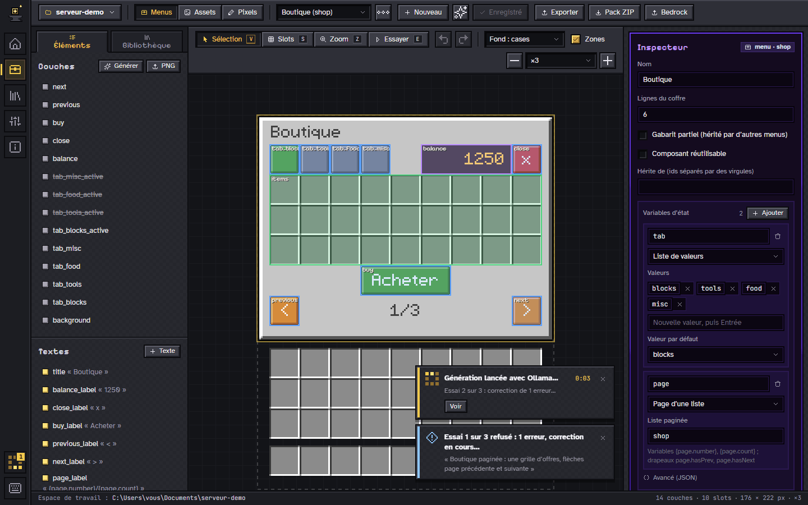
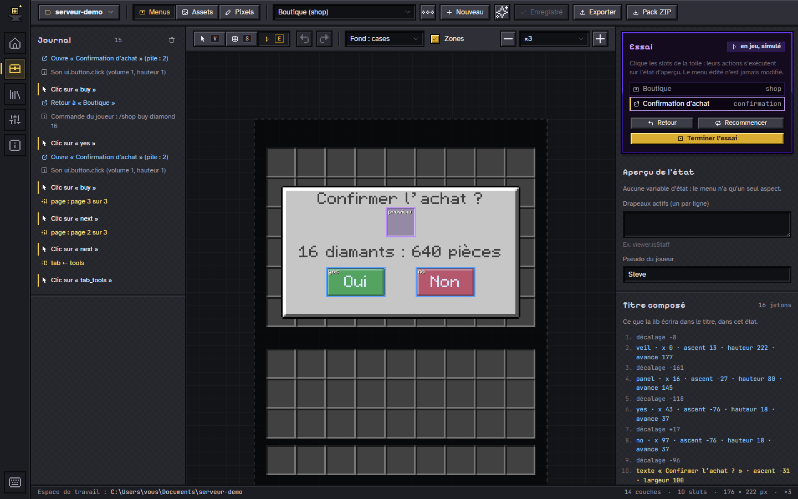
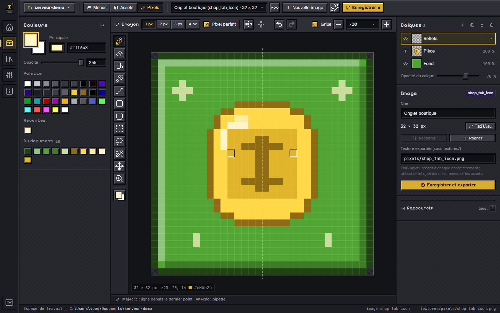
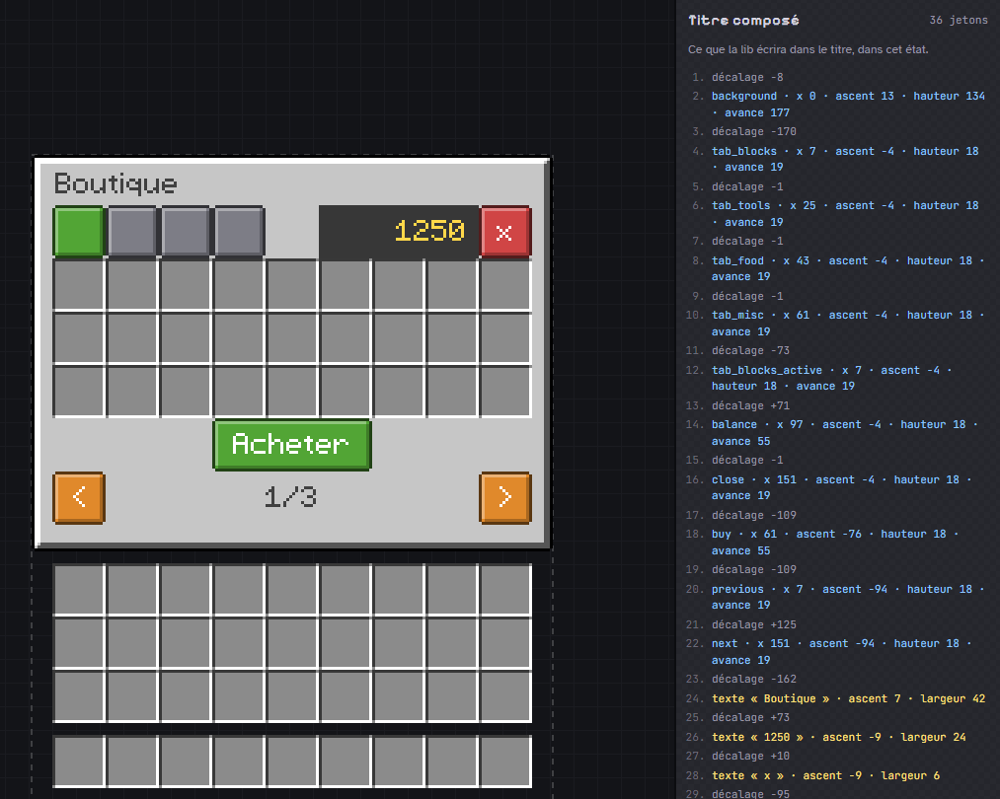

<p align="center">
  
</p>

<h1 align="center">Menu Forge</h1>

<p align="center"><strong>Français</strong> · <a href="README.en.md">English</a></p>

<p align="center">
  <strong>Dessinez des inventaires Minecraft custom au pixel près, ouvrez-les en jeu sur Java comme sur Bedrock.</strong><br>
  Un studio local (appli de bureau ou navigateur), un plugin Paper et un export Bedrock, reliés par un format JSON ouvert.
</p>

<p align="center">
  <a href="https://pedrokarim.github.io/menu-forge/">Site du projet</a> ·
  <a href="docs/guide.md">Guide de prise en main</a> ·
  <a href="docs/README.md">Documentation</a> ·
  <a href="docs/shortcuts.md">Raccourcis</a> ·
  <a href="docs/roadmap.md">Feuille de route</a>
</p>



> **État : jeune projet, en développement actif.** Le rendu est validé en jeu
> (Paper 1.20.6, client Bedrock sur mc-rs), le studio et la lib fonctionnent
> de bout en bout, mais il n’y a pas encore de version publiée : on construit
> depuis les sources.

## Pourquoi

Les menus « modernes » des serveurs Minecraft (onglets, modales, boutons
colorés, barres de progression…) ne sont pas des mods : ce sont des **coffres
vanilla** dont le **titre** contient des images, dessinées par une police du
resource pack. Superbe, mais pénible à fabriquer à la main : chaque couche est
un glyphe, chaque glyphe a son `ascent` et son avance, et un pixel de travers
décale tout ce qui suit.

Menu Forge automatise toute la chaîne : on dessine dans le studio, il exporte
des fichiers `*.menu.json` et leurs PNG, et le plugin Paper compose le titre et
ouvre le menu en jeu. Sur Bedrock, les mêmes menus et des **formulaires
Bedrock** partent en JSON UI vers le serveur natif mc-rs.

Menu Forge est né pour **Enderium**, un serveur Minecraft, qui branche la lib
sur ses actions, ses conditions et son pack par un adaptateur ; la lib, elle,
ne dépend d’aucun type d’Enderium et sert n’importe quel serveur Paper.

## Ce que fait Menu Forge

- **Dessiner au pixel près** : toile calée sur la grille des slots, couches
  générées ou importées, textes dynamiques mesurés avec les avances du jeu,
  police pixel dessinée pour le projet, éditeur de pixels à calques et mode
  libre pour les assets.
- **Générer une interface complète** : boutique, grille, modale, liste
  paginée ou barre d’onglets, dans trois familles de styles, ou l’un des
  **22 exemples** de la galerie, à retoucher ensuite.
- **Rendre le menu vivant, sans JSON** : actions au clic, conditions en
  arbre, états, composants réutilisables, et le mode **Essayer** qui rejoue
  les clics comme en jeu.
- **Java et Bedrock** : un plugin Paper qui ouvre des coffres dont le titre
  est composé glyphe par glyphe ; un export Bedrock (pack JSON UI et
  `runtime.json`) et des formulaires dans les huit dispositions du pack
  `mcrs_ui`, exécutés par mc-rs (`/mf open <id>`).
- **IA facultative** : une texture ou une interface décrite en quelques mots,
  avec onze fournisseurs ; la génération tourne en **tâche de fond**, suivie
  par des notifications, et son résultat est contraint (grille de pixels et
  palette, ou schéma du format) avant d’être relu. Rien ne part sans
  activation, les clés restent dans le trousseau du système.
- **Clavier et confort** : un raccourci pour chaque geste, zoom à une touche,
  colonnes réglables et mémorisées, rien ne déborde de 1024 × 600 au plus
  grand écran.
- **Fiable** : studio et lib produisent les mêmes polices, octet pour octet
  (fixture partagée) ; une suite de bout en bout de 61 tests, avec un
  détecteur de mise en page, rejoue le studio dans un vrai navigateur.

## Captures

| | |
|---|---|
|  |  |
| **Galerie d’exemples** : 22 interfaces toutes faites, rendues en direct. | **Formulaire Bedrock** : disposition, boutons, icônes, aperçu fidèle au pack. |
|  |  |
| **IA en tâche de fond** : progression, essais, notifications. | **Essayer** : les clics s’exécutent comme en jeu. |
|  |  |
| **Éditeur de pixels** : calques, symétrie, zoom jusqu’à ×64. | **Titre composé** : chaque décalage, chaque glyphe. |

Toutes les captures, sur le [site du projet](https://pedrokarim.github.io/menu-forge/#galerie) :
elles sont produites par un script, sur un espace de démonstration fait
uniquement de textures générées ou dessinées par le studio.

## Démarrer

Prérequis : Node 24, Rust stable (1.95 ou plus), WebView2 sous Windows
(présent sur Windows 11) et, pour la lib, un JDK 21.

```sh
git clone https://github.com/pedrokarim/menu-forge.git
cd menu-forge/studio
npm install
npm run tauri:dev     # l’appli de bureau ; npm run dev pour le navigateur
```

La suite, du premier menu à son ouverture en jeu sur Paper puis sur Bedrock :
le [guide de prise en main](docs/guide.md).

## Documentation

Le [sommaire de la documentation](docs/README.md), aussi lisible sur le
[site](https://pedrokarim.github.io/menu-forge/docs/). Les pages les plus
utiles :

- [Guide de prise en main](docs/guide.md) et [raccourcis clavier](docs/shortcuts.md) ;
- [Écrans du studio](docs/screens.md), [générateur d’interfaces](docs/generator.md), [génération par IA](docs/ai.md) ;
- [Format des menus](docs/format.md) et [modèle de rendu](docs/rendering.md) ;
- [Exporter et installer](docs/export.md), [lib et plugin Paper](lib/README.md), [Bedrock](docs/bedrock.md) ;
- [Feuille de route](docs/roadmap.md).

## Structure du dépôt

| Dossier | Rôle |
|---|---|
| [`docs/`](docs/) | Documentation, spécification des formats et schémas JSON (source de vérité) |
| [`studio/`](studio/) | Studio : interface Vite + React + TypeScript (`src/`), backend Rust (`backend/`), coquille Tauri 2 (`src-tauri/`) |
| [`lib/`](lib/) | Lib Java : noyau autonome `menu-forge-core` et plugin `menu-forge-paper` |
| [`templates/`](templates/) | Gabarits fournis (coffre, modale, onglets, liste paginée) |
| [`examples/`](examples/) | Espace de travail d’exemple du mode navigateur (contenu non versionné) |
| [`site/`](site/) | Site du projet (GitHub Pages), ses pages de documentation et le script des captures |

## Contribuer

Les contributions sont bienvenues : ouvrez d’abord une issue pour discuter
d’un changement important. Règles du dépôt (détail dans [`AGENTS.md`](AGENTS.md)) :

- **identifiants en anglais**, sans exception ; commentaires, textes
  d’interface, docs et messages de commit **en français**, avec la
  typographie française ;
- **aucun asset tiers** dans le dépôt : les gabarits et textures fournis sont
  générés ou dessinés par le projet ;
- avant une pull request : `npm run build`, `npm run lint` et `npm test` dans
  `studio/`, `cargo test` dans `studio/backend/`, `./gradlew build` dans
  `lib/`, et `python site/scripts/build.py` si la doc ou le site changent.

## Licence

Menu Forge est distribué sous licence **MIT**, © 2026 Karim (pedrokarim) : voir [`LICENSE`](LICENSE).
Les composants tiers gardent leur propre licence.

| Composant | Usage | Licence |
|---|---|---|
| [Pixelarticons](https://github.com/halfmage/pixelarticons) | Icônes | MIT |
| [Pixelify Sans](https://github.com/eifetx/Pixelify-Sans) | Titres | SIL Open Font License 1.1 |
| [Atkinson Hyperlegible](https://www.brailleinstitute.org/freefont/) | Texte | SIL Open Font License 1.1 |
| [JetBrains Mono](https://github.com/JetBrains/JetBrainsMono) | Code et chemins | SIL Open Font License 1.1 |
| [React](https://react.dev/) | Interface | MIT |
| [Tauri](https://tauri.app/) | Application de bureau | MIT ou Apache 2.0 |
| [Gson](https://github.com/google/gson) | Lecture du format (lib) | Apache 2.0 |

Le studio embarque les polices des paquets `@fontsource` (et Pixelify Sans
dans `studio/public/fonts/` pour l’écran de démarrage) ; le site les
auto-héberge dans `site/assets/fonts/`, chacune avec sa licence.

## Mentions

Menu Forge n’est ni affilié à Mojang ni approuvé par Mojang ; Minecraft est une
marque de Mojang AB. Le dépôt ne contient aucun asset de Minecraft : la police
du jeu et les packs tiers ne sont lus que depuis le poste de l’utilisateur, et
restent la propriété de leurs auteurs.
