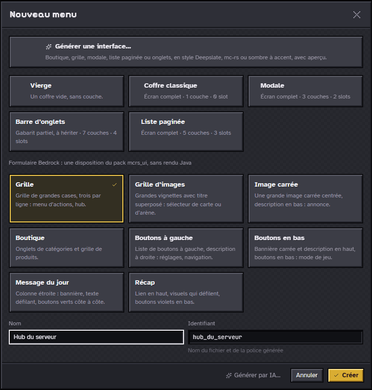

# Guide de prise en main

De l’installation à un premier menu ouvert en jeu, sur Java puis sur Bedrock.
Chaque étape renvoie à la page de référence qui la détaille ; le sommaire
complet de la documentation est dans le [sommaire](README.md).

## 1. Installer et lancer le studio

Prérequis : **Node 24**, **Rust stable** (1.95 ou plus) et, sous Windows,
**WebView2** (présent sur Windows 11). Pour la lib Java : **JDK 21**.

```sh
git clone https://github.com/pedrokarim/menu-forge.git
cd menu-forge/studio
npm install
npm run tauri:dev
```

`npm run tauri:dev` ouvre l’appli de bureau ; `npm run dev` sert le même
studio dans le navigateur, sur `http://localhost:5173` ; `npm run tauri:build`
construit l’installateur Windows. Options et variantes :
[Développer le studio](../studio/README.md).

Au premier lancement, le studio propose un **espace de travail**,
`Documents/menu-forge` (créé s’il manque) : le dossier où vivent les menus
(`menus/`), les assets (`assets/`), les images de pixels (`pixels/`) et les
textures (`textures/`).

## 2. L’accueil


- **Actions rapides** : Nouveau menu, Générer une interface, Nouvel asset,
  Nouvelle image, Importer un écran, Ouvrir un espace ;
- en tête de la section, **Voir les exemples** (la galerie du générateur) et
  **Générer une interface par IA…** ;
- **documents récents**, avec leur vignette ; clic droit ou bouton « … » pour
  renommer, dupliquer ou mettre à la corbeille.

Tous les écrans : [Écrans du studio](screens.md). La touche `?` ouvre
l’aide-mémoire des raccourcis ([Raccourcis clavier](shortcuts.md)).

## 3. Un premier menu Java

Sur Java, un menu est un coffre vanilla dont le **titre** porte le visuel, en
glyphes de police : le plugin Paper MenuForge l’ouvre en jeu. Le principe est
détaillé dans le [modèle de rendu](rendering.md).

### 3.1 Partir d’un exemple

**Voir les exemples** ouvre la galerie du générateur d’interfaces : 22
interfaces toutes faites, filtrables par type et par famille de styles. Un
clic charge un exemple dans les réglages, **Personnaliser** permet de le
retoucher, un double-clic crée le menu tel quel.


On peut aussi partir de **Nouveau menu** : un coffre vierge, un gabarit
(coffre classique, modale, barre d’onglets, liste paginée) ou **Générer une
interface…**. Types, familles et réglages : [Générateur d’interfaces et de
textures](generator.md).

### 3.2 Retoucher dans l’éditeur


- à gauche, les **couches**, les **textes** et les **zones de slots** du menu,
  et la bibliothèque des textures ;
- au centre, la **toile**, calée sur la grille du coffre : `V` sélectionne,
  `S` trace une zone de slots, `Z` zoome ;
- à droite, l’**inspecteur** de la sélection : position, texture, conditions
  et, pour un slot, ses actions au clic et son item, sans écrire de JSON ;
  dessous, l’aperçu de l’état et le **titre composé**, jeton par jeton.

Les colonnes se règlent à la souris par leur bord. Tous les gestes :
[Éditeur de menus](screens.md#éditeur-de-menus).

### 3.3 Essayer

`E` passe en mode **Essayer** : un clic sur un slot exécute ses actions comme
en jeu (onglets, pages, `open` et `back`, fermeture), commandes et sons sont
écrits au journal, et le document n’est jamais modifié. `Échap` revient à
l’édition.


### 3.4 Enregistrer et exporter

1. **Paramètres** (`Ctrl+5`), section **Export vers le plugin** : choisir le
   dossier cible (champ « Dossier du serveur Java (ressources du plugin) »),
   l’espace de noms et le `pack_format` de la version du serveur.
2. `Ctrl+S` enregistre le menu ; `Ctrl+E` exporte tous les menus coffre de
   l’espace dans `<dossier>/menuforge/` (`menus/` et `textures/`).

Pack ZIP de test, manifeste et détails : [Exporter et installer](export.md).

### 3.5 Ouvrir en jeu sur Paper

```sh
cd menu-forge/lib
./gradlew build
```

1. Déposer `menu-forge-paper/build/libs/MenuForge-<version>.jar` dans le
   dossier `plugins/` d’un serveur Paper 1.20.6 ou plus, puis le démarrer.
2. Copier `menus/` et `textures/` de l’export dans
   `plugins/MenuForge/workspace/`.
3. `/menuforge reload` : le plugin régénère le pack de polices dans
   `plugins/MenuForge/pack/`, à intégrer au resource pack du serveur.
4. `/menuforge open <id>` ouvre le menu.

Commandes, configuration et API : [Lib Java et plugin Paper](../lib/README.md).

## 4. Un premier formulaire Bedrock

Un **formulaire Bedrock** est le formulaire à boutons du client Bedrock,
affiché dans l’une des huit dispositions du pack `mcrs_ui` du serveur mc-rs
(grille, grille d’images, image carrée, boutique, boutons à gauche, boutons
en bas, message du jour, récap). Il n’a pas de rendu Java : seul l’export
Bedrock l’emporte.

### 4.1 Créer

**Nouveau menu**, section **Formulaire Bedrock** : choisir une disposition,
donner un nom (l’identifiant suit), puis **Créer**. Le formulaire est
enregistré et s’ouvre dans son éditeur, avec quelques boutons de départ. La
liste **Disposition**, en haut de la colonne de gauche, en change à tout
moment ; ce que lit chaque disposition est décrit dans le
[format](format.md#formulaire-bedrock-form).



### 4.2 Boutons et icônes


- **Ajouter**, dans l’en-tête de la liste, pose un bouton ou, selon la
  disposition, une bannière ou un bouton spécial. Glisser une ligne la
  déplace ; un clic droit la duplique, la monte, la descend ou la supprime.
- L’inspecteur édite le bouton sélectionné : identifiant, texte, sous-titre et
  rôle. Le titre, le contenu et les textes acceptent les codes `§` et les
  variables (`{viewer.name}`…).
- Bloc **Icône** : une texture de l’espace de travail (importée, dessinée dans
  l’éditeur de pixels, tirée d’une bibliothèque), copiée dans le pack à
  l’export ; une texture du jeu citée par son chemin
  (`textures/items/diamond`), jamais copiée ; ou une adresse `https://…`.

### 4.3 Actions, conditions et essai

- **Actions au clic** : `open` (un menu ou un formulaire ; la pile garde le
  chemin), `back`, `close`, `setState`, `sound`, `command` (en joueur ou en
  console), `custom`. Sauf fermeture, le serveur renvoie le formulaire après
  le clic.
- **Envoyé si** (`visibleWhen`) : une condition sur l’état ou sur un drapeau
  du joueur (`viewer.op`…) ; fausse, le bouton n’est pas envoyé. L’index d’un
  clic est donc le **rang parmi les boutons envoyés**.
- `E` rejoue les clics sur l’aperçu, comme le serveur ; les drapeaux et le
  pseudo de l’aperçu se règlent dans la colonne de droite. L’aperçu se zoome
  avec `+`, `-`, `Maj+0`, `Maj+1` et `Maj+2`.

### 4.4 Exporter pour Bedrock

1. **Paramètres › Export pour Bedrock** : le dossier du serveur ; pour mc-rs,
   `menu_forge/export`.
2. Dans l’éditeur, bouton **Bedrock** : tous les menus et formulaires de
   l’espace partent dans ce dossier, le pack de ressources dans `pack/` et le
   descripteur d’exécution dans `runtime.json`.

### 4.5 Lancer sur mc-rs

En jeu, `/mf reload` relit l’export, `/mf list` liste les menus et
formulaires, `/mf open <id>` en ouvre un. Un nouveau visuel (nouvelle icône,
menu coffre) demande en plus une reconnexion du client, qui recharge le pack.
Détails : [Exporter et installer](export.md#sur-un-serveur-bedrock-mc-rs) et
[Menu Forge sur Bedrock](bedrock.md).

## 5. Générer par IA (facultatif)

Une texture ou une interface peut aussi être décrite en quelques mots à une
IA. Rien ne part tant qu’un fournisseur n’est pas activé dans **Paramètres ›
IA** ; les clés d’API vont dans le trousseau du système.

1. Activer un fournisseur (en ligne, sur ce poste ou Codex CLI) et, pour un
   service en ligne, coller sa clé.
2. **Générer une interface par IA…** (accueil, éditeur de menus) ou
   **Générer une texture par IA…** (éditeur de pixels, bibliothèque).
3. La génération tourne en **tâche de fond** : fermer le dialogue ne l’arrête
   pas. Une notification suit sa progression, le rail affiche le nombre de
   générations en cours, et « Ouvrir » ramène le résultat, à relire avant de
   l’enregistrer.


Fournisseurs, coûts, ce qui est envoyé et contraintes : [Génération par
IA](ai.md).

## 6. Pour aller plus loin

- [Écrans du studio](screens.md) et [Raccourcis clavier](shortcuts.md) ;
- [Format des menus](format.md) : couches, états, conditions, actions,
  gabarits, composants, formulaires ;
- [Éditeur de pixels](pixels.md) et [mode libre](assets.md) ;
- [Modèle de rendu Java](rendering.md) et [Menu Forge sur Bedrock](bedrock.md).
