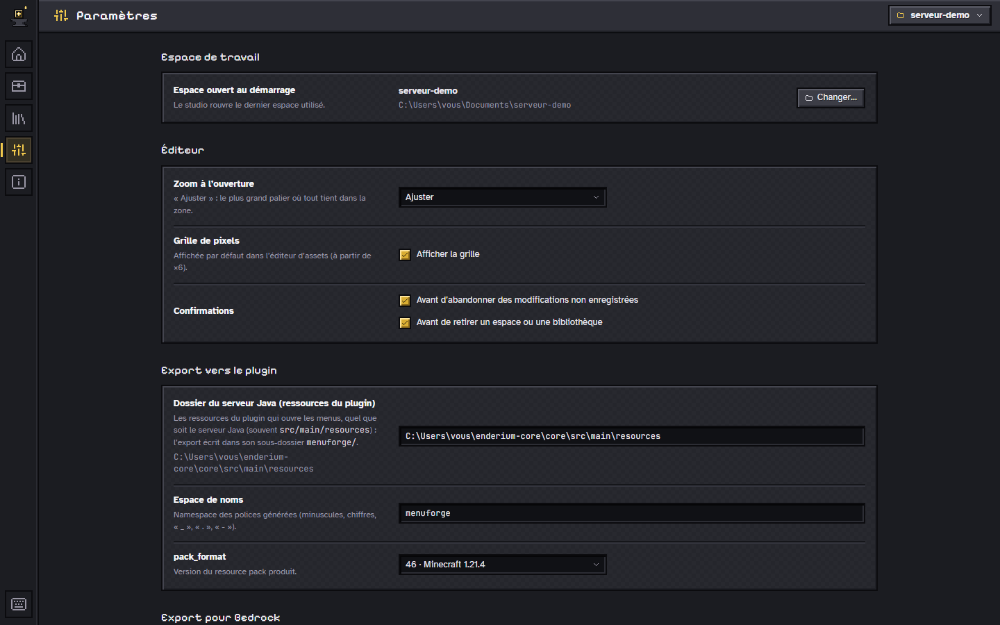

# Écrans du studio

Le studio est une application de bureau (Tauri 2) ou une page servie en
local, au style « Deepslate » : ardoise, biseaux de 2 px, or pour la
sélection, infobulles violettes façon objet du jeu. Cette page décrit chaque
écran ; les raccourcis sont dans [`shortcuts.md`](shortcuts.md), la prise en
main pas à pas dans le [guide](guide.md).

## Navigation

- **Rail** vertical à gauche : Accueil, Éditeur, Bibliothèques, Shaders,
  Paramètres, À propos (`Ctrl+1` à `Ctrl+6`), chacun avec une infobulle qui
  rappelle son raccourci ; l’écran actif est marqué en or. Tant qu’une génération par IA
  tourne, le bas du rail montre un picto animé et leur nombre (voir
  [Notifications](#fenêtre-colonnes-et-notifications)).
- **Pastille de l’espace de travail**, en haut de chaque écran : un clic
  ouvre l’écran Espaces de travail (`Ctrl+O`).
- **Adresse** : l’écran courant est reflété dans l’URL, pour y revenir
  directement.

| Écran | Adresse |
|---|---|
| Accueil | `#/accueil` |
| Espaces de travail | `#/espaces` |
| Éditeur de menus (formulaires Bedrock compris) | `#/editeur/menus/<id>` |
| Éditeur d’assets | `#/editeur/assets/<id>` |
| Éditeur de pixels | `#/editeur/pixels/<id>` |
| Bibliothèques | `#/bibliotheques` |
| Shaders | `#/shaders` |
| Paramètres | `#/parametres` |
| À propos | `#/a-propos` |

Quitter l’éditeur, ou changer d’écran, avec des changements non enregistrés
demande une confirmation. Au premier lancement, sans espace de travail connu,
le studio ouvre l’écran Espaces de travail avec un espace proposé,
`Documents/menu-forge` (créé s’il manque), puis l’accueil.

## Fenêtre, colonnes et notifications

- **Fenêtre** : 1024 × 600 au minimum, et jamais plus grande que la zone utile
  de l’écran au lancement (barre des tâches ôtée, échelle d’affichage
  comprise).
- **Passage à la ligne** : noms, chemins et messages passent à la ligne au
  lieu d’être coupés ; les barres d’outils passent à la ligne par groupes. Seuls
  la barre de titre et les listes déroulantes gardent des points de suspension.
- **Colonnes latérales** : dans les quatre éditeurs (menus, assets, pixels,
  formulaires Bedrock), les colonnes de gauche et de droite se règlent par la
  poignée de leur bord, à la souris ou au clavier, entre une largeur minimale
  et une largeur maximale ; la toile suit en direct et le zoom « Ajuster » est
  recalculé. La largeur est gardée d’une session à l’autre, sur ce poste ;
  double-clic pour la rétablir ([touches](shortcuts.md#colonnes-latérales)).
- **Notifications** : une pile en bas à droite, au-dessus de la barre d’état,
  pour tout le studio : information, progression, succès et erreur, chacune
  avec son picto, un bouton d’action facultatif et « Fermer ». L’information
  et le succès disparaissent seuls (6 s de visibilité, en pause au survol),
  l’erreur et la progression restent. Quatre au plus : les plus anciennes se
  replient derrière un bouton. La pile est masquée tant qu’un dialogue est
  ouvert, pour ne jamais recouvrir ses boutons. Ce qu’une génération par IA y
  affiche : [`ai.md`](ai.md#notifications).

## Accueil

- En-tête : logo de Menu Forge et nom de l’espace actif.
- **Actions rapides**, en grandes cases façon inventaire : Nouveau menu,
  Générer une interface (le [générateur](generator.md)), Nouvel asset,
  Nouvelle image, Importer un écran (un menu reconstruit depuis une police
  d’un pack branché), Ouvrir un espace.
- En tête de la section : **Voir les exemples**, qui ouvre le générateur sur
  sa galerie, et **Générer une interface par IA…** ([`ai.md`](ai.md)).
- **Documents récents** de l’espace (douze au plus) : menus, assets et images
  de pixels, avec leur vignette (rendu du menu, de l’asset ou de l’image ; un
  formulaire Bedrock montre une icône de grille), leur type, leur nom et leur
  date. Un clic ouvre le document ; un clic droit ou le bouton « … » propose
  Ouvrir, Renommer…, Dupliquer et Mettre à la corbeille (le fichier va dans
  `.trash/` de l’espace, rien n’est supprimé).
- **Espaces récents** (cinq au plus) : un clic bascule.

## Espaces de travail

Liste des espaces connus (nom, chemin, nombre de menus, d’assets et de
textures, dernier accès, alerte si le dossier n’existe plus) ; **Ouvrir un
dossier…** (sélecteur natif dans l’appli, saisie du chemin dans le
navigateur), **Retirer de la liste** (ne supprime jamais de fichier),
**Afficher dans l’explorateur**.

## Éditeur

Trois modes : **Menus**, **Assets** et **Pixels** ; un menu qui porte la clé
`form` s’ouvre dans l’éditeur de formulaires Bedrock. Le bouton « … » à côté
du sélecteur de document renomme, duplique ou met à la corbeille le document
ouvert. Les éditeurs secondaires sont chargés à la demande.

### Éditeur de menus

- **À gauche** : les couches, les textes et les zones de slots du menu
  (chaque section a ses actions, dont « Générer une texture… »), et la
  bibliothèque des textures des packs branchés.
- **Au centre** : la barre d’outils (Nouveau menu, outils Sélection `V`,
  Slots `S` et Zoom `Z`, Essayer `E`, niveau de zoom, Exporter, Pack ZIP,
  Bedrock, Générer une interface par IA…) et la toile, calée sur la grille
  du coffre, fond « cases seules » ou coffre vanilla, avec aimantation.
- **À droite** : l’inspecteur de la sélection ; sans sélection, les
  propriétés du menu (lignes, variables d’état, composants inclus) ; dessous,
  l’aperçu d’un état et le **titre composé**, jeton par jeton, avec le même
  algorithme que la lib.

**Nouveau menu.** Le dialogue propose **Générer une interface…** (le
générateur, [`generator.md`](generator.md)), un point de départ (Vierge, ou
un gabarit : Coffre classique, Modale, Barre d’onglets, Liste paginée), les
huit dispositions des **formulaires Bedrock**, puis le nom, l’identifiant et
le nombre de lignes du coffre ; « Générer par IA… » passe à la génération par
IA.

**Rognage (sprites d’atlas).** « Rogner… » (bibliothèque, ou couche
sélectionnée) ouvre un sélecteur à trois modes : tracer une zone, cliquer une
case d’une grille (8, 16, 18, 32, 64 ou taille libre, avec décalage), cliquer
un sprite (zone détectée sur les pixels opaques reliés). « Ajouter et
continuer » pose plusieurs sprites à la suite. Dans un menu, la découpe
devient sa propre texture (`textures/cropped/`), car chaque couche finit en
glyphe ; « Extraire en nouvelle couche » garde l’originale.

**Gestes d’édition.** Sélection multiple (Maj ou Ctrl + clic, rectangle
tracé sur une zone vide, `Ctrl+A`), copier, couper et coller par le
presse-papiers du système (d’un menu à l’autre), duplication (`Ctrl+D`). Une
image PNG collée ou glissée depuis l’explorateur devient une texture puis une
couche. L’inspecteur d’une sélection multiple résume ce qui est commun et
porte la barre **Aligner et répartir** (par rapport à la sélection ou à la
toile). Verrouiller retire un élément de la toile (il reste dans la liste) ;
masquer le cache de la toile seulement (clé `editor` du format).

**Éditer sans JSON.** L’inspecteur d’un slot édite ses **actions au clic**
(liste réordonnable au glisser, aux flèches ou à `Alt+↑` / `Alt+↓`, champs
propres à chaque type, listes des menus, des variables et des listes
paginées, validation en direct), son **item** (invisible, matériau, tête,
référence du serveur, nom et description en MiniMessage avec aperçu coloré)
et ses **conditions** (arbre « toutes », « au moins une », « pas », feuilles
« état égal à », « état parmi », « drapeau », résumé en une ligne, accès
« Avancé (JSON) »). Sans sélection, l’inspecteur édite les variables d’état
du menu : renommer une variable met à jour ses références.

**Essayer** (`E`, `Échap` pour revenir). Un clic sur un slot exécute ses
actions sur l’état d’aperçu, comme en jeu : `setState`, pagination, `open`
(le menu ouvert s’affiche, une pile garde le chemin pour `back`), `close`
(message, puis « Rouvrir ») ; commandes, sons et actions du serveur sont
écrits au journal. Le titre composé suit ; le document n’est jamais modifié.

**Composants.** « Créer un composant… » (menu contextuel d’une sélection)
déplace les éléments dans un nouveau fichier `component: true` et laisse une
instance à leur place. Dans les propriétés du menu, « Composants inclus »
pose, décale, préfixe ou conditionne des instances, ouvre le composant ou
détache une instance. Les éléments d’instance portent la pastille
« composant » et ne se modifient que dans leur composant
([format](format.md#composants)).

**Menus contextuels.** Un clic droit sur un élément propose ses actions
(dupliquer, rogner, ouvrir dans l’éditeur de pixels, créer un composant,
aligner…) ; sur une zone vide, les exports, « Générer une texture… » et
« Générer une interface par IA… ».

### Éditeur de formulaires Bedrock

À gauche, la **disposition** (les huit du pack `mcrs_ui`), le titre, le
contenu et la liste des boutons – glisser pour réordonner, clic droit pour
dupliquer, monter, descendre ou supprimer, « Ajouter » pour un bouton, une
bannière ou un bouton spécial selon la disposition ; l’onglet
« Bibliothèque » fait d’une texture l’icône du bouton sélectionné. Au centre,
l’**aperçu** reprend la géométrie des JSON du pack, sur un écran simulé (PC,
grand ou petit écran), zoomé comme les toiles ; un texte trop long pour la
disposition est signalé « tronqué en jeu ». À droite, l’**inspecteur** du
bouton (identifiant, texte, sous-titre, rôle, icône, « Envoyé si », actions
au clic), puis les variables d’état et les drapeaux de l’aperçu. « Essayer »
(`E`) exécute les clics comme le serveur. Pas à pas :
[guide](guide.md#4-un-premier-formulaire-bedrock) ; format :
[`format.md`](format.md#formulaire-bedrock-form).

### Éditeur d’assets

Le **mode libre** : une composition figée (encart d’aide, bulle de touche,
badge…) faite de boîtes, d’images et de textes, groupables, exportée en un
PNG et proposée en glyphe à coller dans un texte. Format et export :
[`assets.md`](assets.md).

### Éditeur de pixels

Pour dessiner une texture au pixel près : couleurs à gauche, outils et toile
au centre, calques et propriétés de l’image à droite. Chaque enregistrement
écrit le document `pixels/<id>.pixel.json` et un PNG aplati dans `textures/`,
utilisable tel quel dans les menus et les assets. « Ouvrir dans l’éditeur de
pixels » (vignette de bibliothèque, couche) crée une image depuis une
texture ; celle d’un pack n’est jamais modifiée. Outils et format :
[`pixels.md`](pixels.md).

### Générateur d’interfaces et génération par IA

- **Générer une interface** (carte de l’accueil, dialogue « Nouveau menu »)
  et **Générer une texture…** : procéduraux, sans IA
  ([`generator.md`](generator.md)).
- **Générer une interface par IA…** (accueil, barre d’outils et menu
  contextuel de l’éditeur de menus, dialogue « Nouveau menu ») et **Générer
  une texture par IA…** (éditeur de pixels, bibliothèque) : description,
  fournisseur, réglages, puis une génération en tâche de fond, suivie en
  direct ([`ai.md`](ai.md)).

## Bibliothèques

Les packs de ressources branchés, lus en place et jamais publiés : nom,
chemin, propriété (« maison » ou « tiers · local »), nombre de textures et de
polices, date d’indexation. **Ajouter un pack** (dossier d’un resource pack
extrait, avec son nom affiché, son identifiant et sa propriété), **Modifier
le nom et la propriété**, **Réindexer**, **Afficher dans l’explorateur**,
**Débrancher** (rien n’est supprimé sur le disque). Un rappel reste visible :
les assets tiers restent sur ce poste.

## Shaders

Exécute les shaders « core » d’un pack, ou l’un des six exemples intégrés
et commentés, sur une scène d’essai (courbe, portrait, quad libre), avec un
éditeur qui recompile à la frappe et ramène
les erreurs à leur fichier et leur ligne ([`shaders.md`](shaders.md)).

## Paramètres

| Section | Réglages |
|---|---|
| Espace de travail | espace ouvert au démarrage |
| Éditeur | zoom à l’ouverture (« Ajuster » par défaut), grille de pixels, confirmations |
| Export vers le plugin | dossier cible (« Dossier du serveur Java (ressources du plugin) »), espace de noms, `pack_format` ([`export.md`](export.md)) |
| Export pour Bedrock | dossier du serveur Bedrock, qui reçoit `pack/` et `runtime.json` |
| Discord | Rich Presence, identifiant d’application, nom du document affiché ou non ([`discord.md`](discord.md)) |
| IA | une fiche par fournisseur : activer, clé d’API rangée dans le trousseau du système, modèles, adresse, test de connexion ; chargée à la demande ([`ai.md`](ai.md)) |
| Avancé | fichier de réglages (affiché dans l’explorateur), caches d’index |

Réglages et forme du fichier : [API locale](../studio/README.md#api-locale).

## À propos

Logo, version, mode (appli ou navigateur), chemin des réglages, licences des
composants tiers et mention : « Menu Forge n’est ni affilié à Mojang ni
approuvé par Mojang ; Minecraft est une marque de Mojang AB. »

## Aide-mémoire des raccourcis

La touche `?` ouvre une fenêtre au style infobulle, en sept groupes :
navigation, sélection et presse-papiers, éditeur de menus, éditeur de
formulaires Bedrock, éditeur d’assets, éditeur de pixels, toile. Le même
contenu : [`shortcuts.md`](shortcuts.md).
