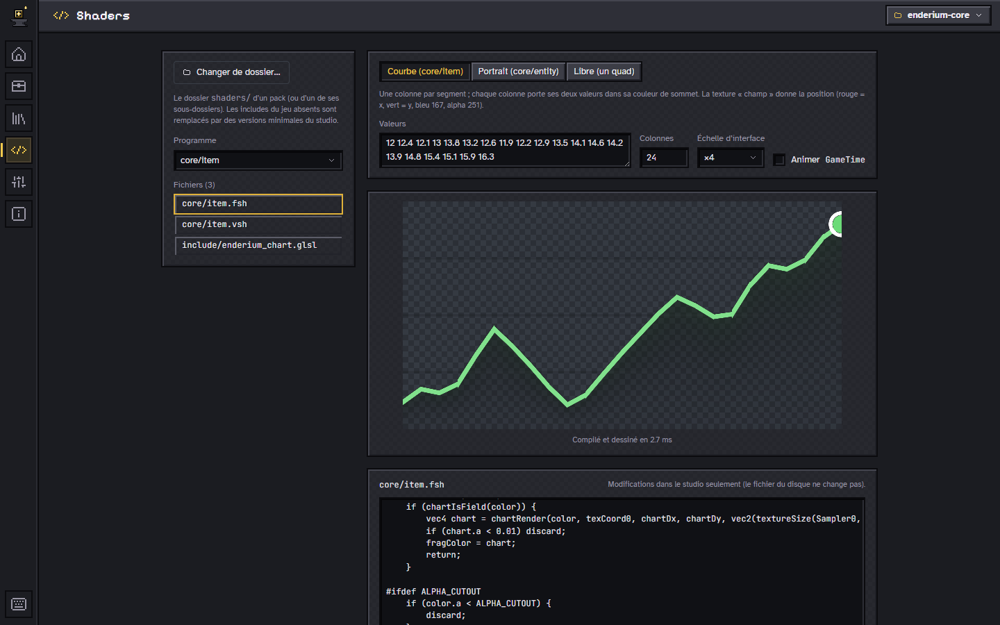

# Visualiseur de shaders

L’écran **Shaders** (`Ctrl+4`) exécute les shaders « core » d’un resource pack
(`assets/minecraft/shaders/`) dans le studio, sans lancer Minecraft : on voit
ce que fait un script, on le modifie et le rendu suit à la frappe. Il sert à
comprendre un shader existant et à mettre au point une technique d’interface
(courbes, portraits, effets de texte) avant de l’essayer en jeu.

## Utilisation

1. **Exemples** : l’écran s’ouvre sur le premier exemple intégré ; un clic
   en charge un autre (fichiers, scène, animation). Chaque exemple dit ce
   qu’il fait et quoi essayer.
2. **Ouvrir les shaders d’un pack…** : le dossier `shaders/` d’un pack, ou
   l’un de ses parents. Seuls les `.vsh`, `.fsh` et `.glsl` sont lus ; les
   chemins sont pris à partir de `shaders/` (`core/item.fsh`,
   `include/ma_lib.glsl`).
3. **Programme** : une paire `.vsh` / `.fsh` trouvée parmi les fichiers.
4. **Scène** : ce que le jeu enverrait au shader (voir plus bas).
5. **Éditeur** : cliquer un fichier dans la liste l’ouvre ; chaque
   modification recompile et redessine (après un court délai). Les erreurs sont
   ramenées au fichier et à la ligne d’origine, même dans un include ; un clic
   sur `fichier:ligne` ouvre ce fichier. **Revenir à l’original** annule les
   retouches de l’onglet.
6. **Onglets** : chaque exemple ou dossier ouvert a son onglet et garde ses
   brouillons, même quand on change d’écran ; un carré d’or marque un onglet
   modifié (et un fichier modifié dans la liste). Rien n’est écrit sur le
   disque : fermer un onglet modifié demande d’abandonner les modifications.

## Exemples intégrés

| Exemple | Scène | Ce qu’il montre |
|---|---|---|
| Les bases | libre | le plus petit shader utile, commenté ligne par ligne : le vertex shader place les coins, le fragment shader colore les pixels |
| Noir et blanc | libre | un calcul de couleur pixel par pixel (luminosité perçue) |
| Vague animée | libre | lire la texture à côté, d’un décalage qui suit `GameTime` |
| Déclencheur par couleur | libre | la technique des serveurs : une teinte précise (`#FFFD01`) active un effet, toute autre teinte garde le rendu normal |
| Courbe de prix (Enderium) | courbe | un graphe de menu dont chaque colonne porte ses valeurs dans sa teinte ; six styles au choix dans la scène |
| Histogramme (Enderium) | courbe | une barre par colonne, verte si elle monte par rapport à la précédente |
| Chandeliers (Enderium) | courbe | ouverture, fermeture, plus haut et plus bas sur 6 bits chacun, corps et mèche |
| Prix et volume (Enderium) | courbe, taille large | le prix en haut, le volume en barres discrètes en bas |
| Mini-courbe (Enderium) | courbe, taille mini | 50 × 12 px pour une ligne de liste : trait fin, ni grille ni point |
| Portrait du profil (Enderium) | portrait | un buste en 3D calculé par lancer de rayons dans la skin |

Les fichiers sont dans `studio/src/shader/examples/<id>/`, rangés comme dans
un pack ; la liste et les textes, dans `studio/src/shader/examples.ts`. Les
exemples « Enderium » reprennent les includes d’Enderium, qui s’en sert en
jeu.

Les modifications restent dans le studio : le fichier du disque ne change pas.
Recopier le texte dans le pack une fois satisfait.

**Échelle d’interface** reproduit l’échelle de l’interface du jeu (×2 à ×6) :
les shaders qui calculent une épaisseur en pixels d’écran changent d’aspect
avec elle. **Animer `GameTime`** fait avancer le temps du jeu (un cycle de
1 200 secondes, comme une journée de 20 minutes).

## Scènes

| Scène | Programme essayé | Ce qui est dessiné |
|---|---|---|
| Courbe | `core/item` | une zone découpée en colonnes (24 par défaut) : chaque colonne porte ses données dans sa couleur de sommet et pointe dans l’atlas vers une texture « champ » 256 × 256 (rouge = x, vert = y, bleu = 167 + style, alpha 251) ; **style** (aire, ligne, mini-courbe, histogramme, chandeliers, prix et volume) et **taille** (grand 158 × 82, large 158 × 34, moyen 73 × 27, mini 50 × 12) au choix, codage identique à Enderium |
| Portrait | `core/entity` | la face avant d’une tête de joueur de 68 × 70 px, chapeau devant ; skin 64 × 64 par défaut ou fournie |
| Libre | celui du dossier | un quad de 128 × 128 px, coordonnées de texture de 0 à 1 sur une image fournie (damier par défaut), couleur de sommet réglable |

Les scènes « Courbe » et « Portrait » reprennent les techniques d’interface
d’Enderium : on peut y ouvrir leurs shaders tels quels.

## Ce qui est reproduit, ce qui ne l’est pas

Le rendu utilise WebGL2 (GLSL ES 3.00) :

- `#version 330` devient `#version 300 es` avec une précision haute ;
- `#moj_import <minecraft:…>` est remplacé par le fichier du dossier
  (`include/…`), sinon par une version minimale fournie par le studio :
  `dynamictransforms`, `projection`, `globals`, `fog` (sans brouillard),
  `light`, `sample_lightmap` (carte de lumière blanche) ; un include introuvable
  est signalé sous le rendu ;
- attributs `Position`, `Color`, `UV0`, `UV1`, `UV2`, `Normal` ;
- `ProjMat` orthographique en pixels d’interface (y vers le bas),
  `ModelViewMat` et `TextureMat` identité, `ColorModulator` blanc,
  `ScreenSize` en pixels du rendu, `GameTime` ;
- `Sampler0` = texture de la scène sans lissage, `Sampler1` et `Sampler2`
  blancs ; test de profondeur et mélange alpha.

Non reproduit : les autres étapes du jeu (post-effets, cibles de rendu), les
blocs uniformes exacts du jeu (les uniformes sont déclarés un par un), les
`#define` posés par le jeu selon le contexte, les différences de précision entre
GLSL 330 et GLSL ES. Un shader qui compile ici peut donc encore échouer en jeu
(et l’inverse, rarement) : la vérification finale se fait dans Minecraft.
